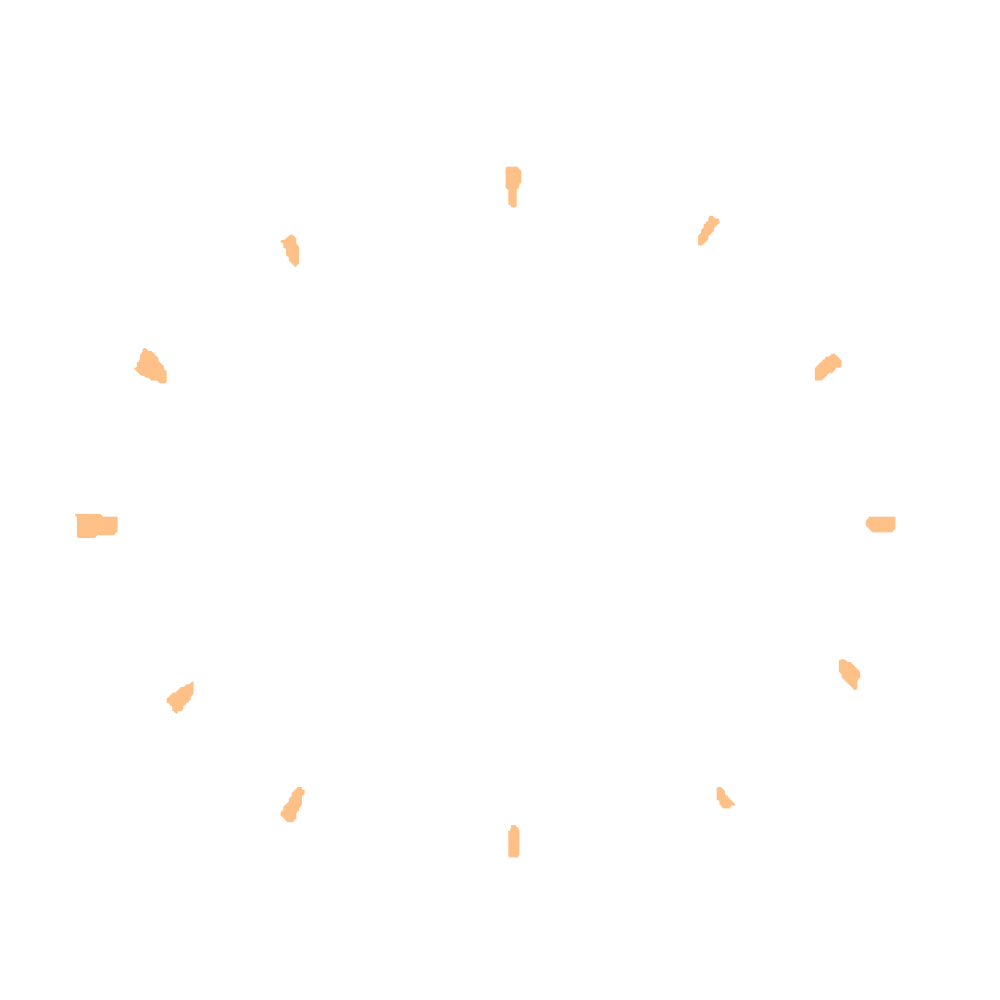

  
  

 # 𝐊𝐚-𝐂𝐡𝐢𝐧𝐠: 𝐀𝐈 𝐀𝐠𝐞𝐧𝐭-𝐏𝐨𝐰𝐞𝐫𝐞𝐝 𝐌𝐮𝐥𝐭𝐢𝐬𝐢𝐠 𝐖𝐚𝐥𝐥𝐞𝐭

  
  <h3>Wallet setup so easy, your grandma could do it.</h3>
  
  

    <em>AI Agent-Powered Multisig Wallet + Explainable AI Fraud Prediction + Gamified Gas Fees + Easy UI</em>
  

  

    
    
    
    
  

   

  <!-- "Powered by" logos section -->
  <h4>Powered by:</h4>
  

    
    
    
    
    
    
      
  

## 📋 𝐓𝐚𝐛𝐥𝐞 𝐨𝐟 𝐂𝐨𝐧𝐭𝐞𝐧𝐭𝐬

1. [Overview](#overview)
2. [Problem Statement](#problem-statement)
3. [Features](#features)
4. [Getting Started](#getting-started)
5. [User Interface](#user-interface)
6. [Solution Architecture](#solution-architecture)
7. [Market Analysis](#market-analysis)
8. [Contact](#contact)
   

---
## 𝐎𝐯𝐞𝐫𝐯𝐢𝐞𝐰
𝐊𝐚-𝐂𝐡𝐢𝐧𝐠 is an AI-driven multisig wallet designed to make managing and securing digital assets simple and accessible. Powered by advanced AI features and decentralized protocols, Ka-Ching enables real-time fraud detection, AI-assisted wallet creation, customizable security, and a gamified experience—all built to work seamlessly in the Web 3 ecosystem.

(<a href="#readme-top">back to top</a>)

---

## 𝐏𝐫𝐨𝐛𝐥𝐞𝐦 𝐒𝐭𝐚𝐭𝐞𝐦𝐞𝐧𝐭
Managing multisig wallets and staying secure in the Web 3 space can be complex and overwhelming, especially for new users. Traditional multisig setups are often tedious, notifications lack immediacy, and fraud prevention mechanisms lack transparency and adaptability. Our goal is to lower entry barriers, improve security, and enhance user experience through AI and decentralized technologies.

(<a href="#readme-top">back to top</a>)

---

## 𝐅𝐞𝐚𝐭𝐮𝐫𝐞𝐬

### 🔍 On-Chain Fraud Behavior Detection Powered by Explainable AI and Cartesi
Our AI-driven fraud detection system uses **LIME (Local Interpretable Model-agnostic Explanations)** to analyze transactions in real time. This gives users clear, actionable insights into why a transaction might be flagged, enabling smarter decision-making. **Cartesi Rollups** handle complex computations off-chain for scalable, transparent fraud detection while settling critical data on-chain.

### 🤖 AI Agent-Powered Wallet Creation
With a single prompt, users can set up a multisig wallet without the usual repetitive steps. This feature leverages Google Gemini AI agents to streamline the setup process, making it accessible even for those with no technical experience. 

### 🔔 Seamless 2FA Authentication 
Integrated **Two-Factor Authentication (2FA)** powered by **WorldID** adds an extra layer of security with privacy-preserving, zero-knowledge proofs.

### 🎮 Bonus: The Thai Challenge: A New Take on Rock, Paper, Scissors
Adding a unique twist, Ka-Ching features a blockchain-powered game inspired by Thai street life—Tuk-Tuk, Traffic Jam, and Food Cart—where users can settle the age-old question of "Who’s covering the gas fee?" 

| **Element**   | **Defeats**    | **Reason**                                                    |
|---------------|----------------|----------------------------------------------------------------|
| Tuk-Tuk       | Traffic Jam    | Tuk-Tuk zips through the traffic.                              |
| Traffic Jam   | Food Cart      | Traffic Jam blocks the Food Cart.                              |
| Food Cart     | Tuk-Tuk        | The Food Cart feeds the hungry driver (because who can resist Thai street food?) |

(<a href="#readme-top">back to top</a>)

---

## 𝐆𝐞𝐭𝐭𝐢𝐧𝐠 𝐒𝐭𝐚𝐫𝐭𝐞𝐝

To get started with Ka-Ching:
1. Clone the repository.
2. Set up your wallet using our AI Agent-Powered Wallet Creation feature with a single prompt.
3. Explore features like on-chain notifications, customized security, and fraud detection.

(<a href="#readme-top">back to top</a>)

---

## 𝐔𝐬𝐞𝐫 𝐈𝐧𝐭𝐞𝐫𝐟𝐚𝐜𝐞

The Ka-Ching wallet interface is designed for simplicity, allowing users of all experience levels to interact with their assets intuitively. Core features like transaction approval, fraud alerts, and wallet customization are accessible via a clean, user-friendly layout.

(<a href="#readme-top">back to top</a>)

---

## 𝐒𝐨𝐥𝐮𝐭𝐢𝐨𝐧 𝐀𝐫𝐜𝐡𝐢𝐭𝐞𝐜𝐭𝐮𝐫𝐞

(<a href="#readme-top">back to top</a>)

---

## 𝐌𝐚𝐫𝐤𝐞𝐭 𝐀𝐧𝐚𝐥𝐲𝐬𝐢𝐬

The demand for secure, AI-enhanced multisig wallets is surging, with the blockchain market projected to grow at an 85.9% CAGR through 2030 (Grand View Research). Ka-Ching targets high-value segments including:

- **DAOs and DeFi Projects**: These entities require secure, transparent, and collaborative asset management solutions. With over $75 billion locked in DeFi as of 2023, there is substantial demand for multisig wallets that prioritize security and fraud detection.
  
- **Institutional Investors**: As 47% of hedge funds plan digital asset investments by 2024 (PwC), Ka-Ching’s AI-driven fraud detection aligns well with institutional needs for regulatory compliance and ease of use.

- **High-net-worth Individuals and Family Offices**: Increasingly investing in crypto, over 12% of family offices now hold digital assets. Ka-Ching's user-friendly wallet creation and fraud insights serve this segment’s demand for secure management tools.

(<a href="#readme-top">back to top</a>)

---

## Project Impact

Investing in Ka-Ching means supporting a transformative leap in the DeFi space. Our Explainable AI-powered multisig wallet addresses two of the biggest challenges in decentralized finance—security and usability. By proactively detecting and explaining potential fraud before transactions occur, Ka-Ching provides users with a level of confidence and control that’s rare in today’s DeFi ecosystem. This isn’t just about protecting individual users; it’s about building trust across the entire Web3 economy, reducing fraud, and empowering more people to participate safely in decentralized finance.

## 𝐂𝐨𝐧𝐭𝐚𝐜𝐭

### Meet the GMI Team:

| Member       | Role             | Description                              | LinkedIn                                  | Gmail                       | Twitter                       |
|--------------|------------------|------------------------------------------|-------------------------------------------|-----------------------------|-------------------------------|
| **Elise Chiong** | Product Design   | The woman behind the website and app     | [LinkedIn](https://www.linkedin.com/in/elisechiong) | elisechiong@gmail.com       | [@elisechiong](https://twitter.com/elisechiong) |
| **Joey Lau**    | Product & AI      | She makes data talk and product walk     | [LinkedIn](https://www.linkedin.com/in/joeylau)     | joeylau@gmail.com           | [@joeylau](https://twitter.com/joeylau)         |
| **Weoy Yang**   | Engineering       | The backend magician                     | [LinkedIn](https://www.linkedin.com/in/weoyyang)    | weoyyang@gmail.com          | [@weoyyang](https://twitter.com/weoyyang)       |
| **Hao Xiang**   | Engineering       | The system architect                     | [LinkedIn](https://www.linkedin.com/in/haoxiang)    | haoxiang@gmail.com          | [@haoxiang](https://twitter.com/haoxiang)       |
| **Li Sheng**    | Engineering       | The frontend wizard                      | [LinkedIn](https://www.linkedin.com/in/lisheng)     | lisheng@gmail.com           | [@lisheng](https://twitter.com/lisheng)         |

Got questions, ideas, or just want to say hi? Reach out to us—we promise we don’t bite (much)! 

Let’s connect and see where the conversation (or collaboration) takes us! 😊

(<a href="#readme-top">back to top</a>)

---
